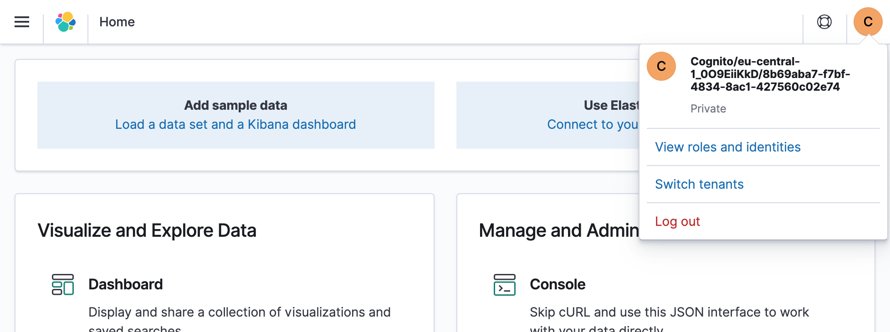
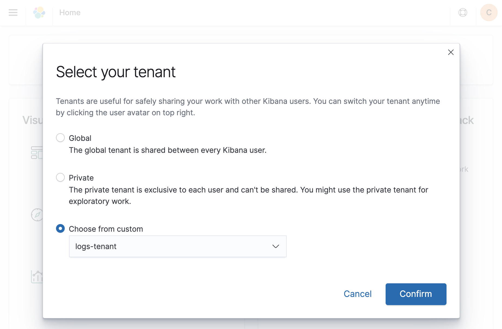

# Launch Amazon Elasticsearch Service with Amazon Cognito User Pools

To get started with [Amazon Elasticsearch Service](https://aws.amazon.com/elasticsearch-service/) (Amazon ES), you must have a concept for authentication and authorization for your search cluster. In addition to an IP-based access policy or a proxy server to protect your search cluster, you can leverage AWS Identity and Access Management (IAM) with Amazon Cognito User Pools to authenticate and authorize users. You can configure this using the AWS Management Console or the AWS Command Line Interface (AWS CLI). More information on configuration can be found in the [Amazon Cognito Authentication for Kibana documentation](https://docs.aws.amazon.com/elasticsearch-service/latest/developerguide/es-cognito-auth.html).

An Infrastructure-as-Code approach allows you to complete deployment and configuration in a safe, repeatable manner, so you can build and rebuild your search cluster automatically.

This is the sample code for the concepts described in the blog post [Launch Amazon Elasticsearch Service with Amazon Cognito User Pools](https://aws.amazon.com/blogs/field-notes/launch-amazon-elasticsearch-service-with-amazon-cognito-user-pools/). It contains a [AWS Cloud Development Kit](https://aws.amazon.com/cdk/) (AWS CDK) template for the fully automated provisioning of the Amazon ES and Amazon Cognito resources, as well as your first search index and Kibana dashboard. The template structure is also applicable if you prefer to use AWS CloudFormation.

## Get Started

Deploy the sample template from the AWS Serverless Application Repository:

[](https://serverlessrepo.aws.amazon.com/applications/arn:aws:serverlessrepo:us-east-1:387304072572:applications~amazon-elasticsearch-service-with-cognito)

## Deploy the template from code

The template provisions an Amazon Elasticsearch Service cluster in a fully automated way. The search cluster consists of a single `t3.small.elasticsearch` instance with 10GB of EBS storage. It is integrated with Amazon Cognito User Pools so you only need to add your user(s). The template also configures an example Kibana dashboard and an Amazon ES index template.

The template prefixes the search domain and the Amazon Cognito Hosted UI with a string that you can define with the `applicationPrefix` template parameter.

You can either deploy the template with AWS CloudFormation or CDK. Both options require you to install and configure the [AWS CLI](https://docs.aws.amazon.com/cli/latest/userguide/cli-chap-install.html) and the [CDK](https://docs.aws.amazon.com/cdk/latest/guide/getting_started.html).

The CDK template is written in TypeScript. TypeScript sources must be compiled to JavaScript initially and after each modification. Open a new terminal and keep this terminal open in the background if you like to change the source files. Change the directory to the one where `cdk.json` is and execute:

```bash
npm install
npm run watch
```

Read the [CDK developer guide](https://docs.aws.amazon.com/cdk/latest/guide/home.html) for more information.
### Deployment using CDK

Create or update the application with `cdk deploy`.

```bash
cdk deploy -c applicationPrefix=<PREFIX>
```

### Access the Example Dashboard

As soon as the application is deployed completely the outputs of the AWS CloudFormation stack provides the links for the next steps. You will find two URLs in the AWS CloudFormation console called `createUserUrl` and `kibanaUrl`.


* Use the `createUserUrl` link from the outputs, or navigate to the Amazon Cognito user pool in the console to create a new user in the pool. **Enter an email address as username and email**. **Enter a temporary password** of your choice with at least 8 characters. Leave the phone number empty and **uncheck the checkbox to mark the phone number as verified**. If you like you can check the checkboxes to send an invitation to the new user or to make the user verify the email address. Then choose **Create user**.

    

* The user has access restricted to the `logs-tenant`. If you want to provide full access control, including security management permissions, add the user to the `es-admins` group:

    

* Access the Kibana dashboard with the `kibanaUrl` link from the outputs, or navigate to the Kibana link displayed in the Amazon Elasticsearch Service console.

* In Kibana, go to the tenant selection by choosing the **user menu** on the top right. Choose **Switch tenants**:

    

* Choose the `logs-tenant` that has been created during the launch of the application. Choose **Confirm**.

    

* Choose the **navigation menu** on top left and choose **Dashbaord**. Choose the **Example Dashboard**. The dashboard contains instructions to add new documents to the search index and to visualize the documents with the graph in the dashboard.

    

## Cleaning Up

To avoid incurring charges, delete the AWS CloudFormation stack when you are finished experimenting via `cdk destroy` in the directory where `cdk.json` is:

```bash
cdk destroy
```

Or delete the AWS CloudFormation stack manually:

* Sign in to the AWS CloudFormation console and choose your stack.
* Choose **Delete** to delete all resources, including the search cluster and the Amazon Cognito user pool.

## FAQs

### Q: In which region can I deploy the sample application?

The Launch Stack button above opens the AWS Serverless Application Repository in the US East 1 (Northern Virginia) region. You may switch to other regions from there before deployment.

### Q: How much do resources in this template cost?

Standard AWS charges apply to the resources you deploy with this template.

Amazon Elasticsearch Service provides customers in the [AWS Free Tier](https://aws.amazon.com/free/) free usage of up to 750 hours per month of the configuration in this template, i.e. a single-AZ `t3.small.elasticsearch` instance and 10GB of EBS storage for up to one year from the date the account was created. If you exceed the free tier limits, you will be charged the Amazon Elasticsearch Service rates for the additional resources you use.

The Amazon Cognito User Pool feature has a free tier of 50,000 monthly active users for users who sign in directly to Cognito User Pools. The free tier does not automatically expire at the end of your 12 month AWS Free Tier term, and it is available to both existing and new AWS customers indefinitely.

See offer terms of [Amazon Cognito](https://aws.amazon.com/cognito/pricing/) and [Amazon Elasticsearch Service](https://aws.amazon.com/elasticsearch-service/pricing/) for more details.
### Q: How can I add a new question to this list?

If you found yourself wishing this set of frequently asked questions had an answer for a particular problem, please [submit a pull request](https://help.github.com/articles/creating-a-pull-request-from-a-fork/). The chances are good that others will also benefit from having the answer listed here.

### Q: How can I contribute?

See the [Contributing Guidelines](CONTRIBUTING.md) for details.

## License

This library is licensed under the MIT-0 License. See the [LICENSE](LICENSE) file.