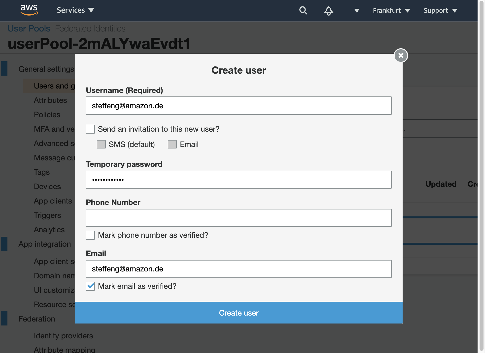
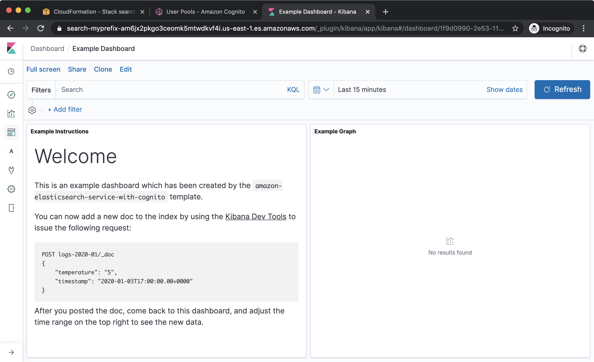

# Launch Amazon Elasticsearch Service with Amazon Cognito User Pools

When you want to get started with [Amazon Elasticsearch Service](https://aws.amazon.com/elasticsearch-service/), you must have a concept for authentication and authorization for your search cluster. Besides using an IP-based access policy or a proxy server to protect your search cluster, you can leverage AWS Identity and Access Management (IAM) with Amazon Cognito User Pools to authenticate and authorize users.

You can configure this using the AWS Management Console or the AWS CLI as described in the [documentation](https://docs.aws.amazon.com/elasticsearch-service/latest/developerguide/es-cognito-auth.html). Using an Infrastructure-as-Code approach, you can do this in a safe, repeatable manner, allowing you to build and rebuild your search cluster, without having to perform manual actions. This code repository provides an [AWS Cloud Development Kit](https://aws.amazon.com/de/cdk/) (CDK) template for the fully automated provisioning.

## What does this template do?

The templates provisions an Amazon Elasticsearch Service cluster with a single `t2.small.elasticsearch` node in a fully automated way. The search cluster is integrated with Amazon Cognito User Pools so you just need to add your user(s). The template also configures an example Kibana dashboard and an Elasticsearch index template using an AWS CloudFormation custom resource based on AWS Lambda.

The template prefixes the search domain and the Amazon Cognito Hosted UI with a string you can define with the `applicationPrefix` template parameter.

## Get Started

This template is available as an application in the AWS Serverless Application Repository. You can deploy it to your account from there:

[](https://serverlessrepo.aws.amazon.com/applications/arn:aws:serverlessrepo:us-east-1:387304072572:applications~amazon-elasticsearch-service-with-cognito)

## Deploy from code

You can either deploy the template with AWS CloudFormation or CDK. Both require you to install and configure the [AWS CLI](https://docs.aws.amazon.com/cli/latest/userguide/cli-chap-install.html) and the [CDK](https://docs.aws.amazon.com/cdk/latest/guide/getting_started.html).

The CDK template is written in Typescript. Since TypeScript sources need to be compiled initially to JavaScript and every time you make a modification to the `.ts` source files you need to compile them to `.js` files. Open a **new** terminal and keep this terminal open in the background if you like to change the source files. Change the directory to the one where `cdk.json` is and execute:

```sh
npm install
npm run watch
```

Find more information in the [CDK developer guide](https://docs.aws.amazon.com/cdk/latest/guide/home.html).


### Deployment using AWS CloudFormation

1. **Synthesize** the CDK template to an AWS CloudFormation template like this:

    ```bash
    cdk synth --version-reporting false > synth.yaml
    ```

2. **Package** the files for deployment with SAM (see [SAM docs](https://docs.aws.amazon.com/serverless-application-model/latest/developerguide/serverless-deploying.html) for details) to a bucket of your choice. The bucket's region must be in the region you want to deploy the sample application to:

    ```sh
    aws cloudformation package \
        --template-file synth.yaml \
        --output-template-file packaged.yaml \
        --s3-bucket <BUCKET> \
        --region <REGION>
    ```

3. Deploy the packaged application to your account:

    ```sh
    aws cloudformation deploy
        --template-file packaged.yaml \
        --stack-name <STACKNAME> \
        --parameter-overrides applicationPrefix=<PREFIX> \
        --capabilities CAPABILITY_IAM \
        --region <REGION>
    ```

### Deployment using CDK

1. An alternative is the deployment with CDK. In this case CDK needs the AWS Lambda function code already packaged
    in S3. Run the **synthesize** and **package** steps described before to package the code:

    ```sh
    cdk synth > synth.yaml
    aws cloudformation package \
        --template-file synth.yaml \
        --output-template-file packaged.yaml \
        --s3-bucket <BUCKET> \
        --region <REGION>
    ```

2. Deploy with `cdk deploy`. This CDK template can retrieve the S3 URL to your AWS Lambda function code package from the previously packaged
template - provided in the `SAM_PACKAGED_TEMPLATE` environment variable:

    ```sh
    SAM_PACKAGED_TEMPLATE=$(cat packaged.yaml) \
    AWS_DEFAULT_REGION=<REGION> \
    cdk deploy -c applicationPrefix=<PREFIX>
    ```

### Access the example dashboard

For your convenience, as soon as the application is deployed completely the output of the AWS CloudFormation
stack provides the links for the next steps:


1. Create a User: use the *createUserUrl* link from the outputs or navigate to the Amazon Cognito User Pool in the console to create a new user in the pool like this:



2. Access the Kibana dashboard with the *kibanaUrl* link from the outputs or navigate to the Kibana link displayed in the Amazon Elasticsearch Service console. In Kibana, click the Dashboard icon in the left menu bar and open the *Example Dashboard*.



## FAQs

### Q: In which region can I deploy the sample application?

The Launch Stack button above opens the AWS Serverless Application Repository in the US East 1 (Northern Virginia) region. You may switch to other regions from there before deployment.

### Q: How can I add a new question to this list?

If you found yourself wishing this set of frequently asked questions had an answer for a particular problem, please [submit a pull request](https://help.github.com/articles/creating-a-pull-request-from-a-fork/). The chances are good that others will also benefit from having the answer listed here.

### Q: How can I contribute?

See the [Contributing Guidelines](CONTRIBUTING.md) for details.

## License

This library is licensed under the MIT-0 License. See the [LICENSE](LICENSE) file.